<p align="center">
  
</p>

<h1 align="center">Tracker</h1>

<p align="center">
  <strong>Open-Source Event Tracking</strong>
  <br />
  <em>Track events, monitor deployments, and manage your infrastructure</em>
</p>

<p align="center">
  <a href="https://github.com/BananaOps/tracker/actions/workflows/release.yml">
    
  </a>
  <a href="https://github.com/BananaOps/tracker/releases">
    
  </a>
  <a href="https://github.com/BananaOps/tracker/blob/main/LICENSE">
    
  </a>
  <a href="https://goreportcard.com/report/github.com/BananaOps/tracker">
    
  </a>
  <a href="https://pkg.go.dev/github.com/BananaOps/tracker">
    
  </a>
</p>

<p align="center">
  
  
  
  
  
  
</p>

---

## 🎯 What is Tracker?

**Tracker** is a comprehensive event tracking and observability platform designed for modern distributed systems. It helps teams monitor deployments, track incidents, manage infrastructure catalogs, and coordinate operations across services.

### Why Tracker?

- **🆓 Free & Open Source** - No vendor lock-in, full control over your data
- **🚀 Easy to Deploy** - Single Docker image with frontend & backend
- **📊 Rich UI** - Beautiful React interface with dark mode
- **🔌 Multi-Protocol** - gRPC, REST, and Swagger UI
- **📈 Observable** - Built-in Prometheus metrics
- **🔄 Real-time** - Track events as they happen
- **🎨 Customizable** - Extend and adapt to your needs

---

## 🖥️ Interface

### Dashboard

Real-time overview with event velocity chart, environment breakdown, and live activity stream.

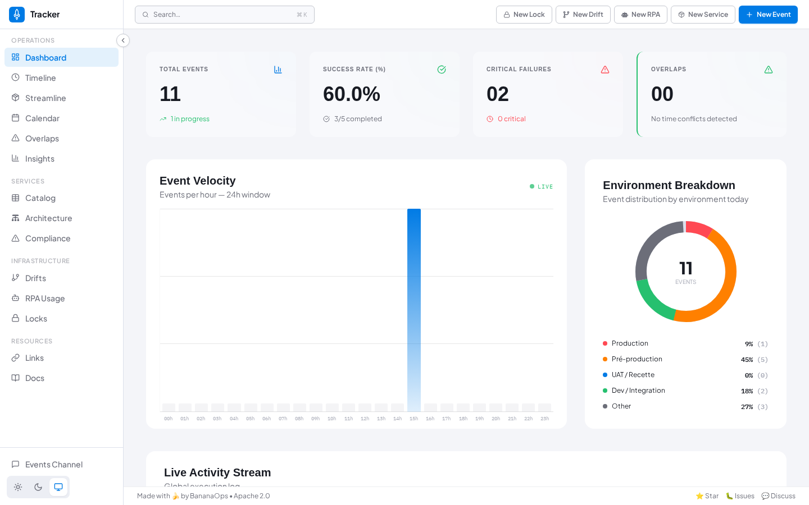

### Timeline

Chronological list of all events with advanced filtering by type, environment, priority and status.

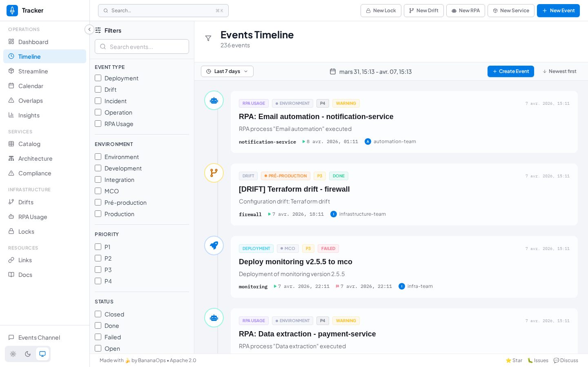

### Streamline

Gantt-style visualization to detect and manage scheduling conflicts across services.

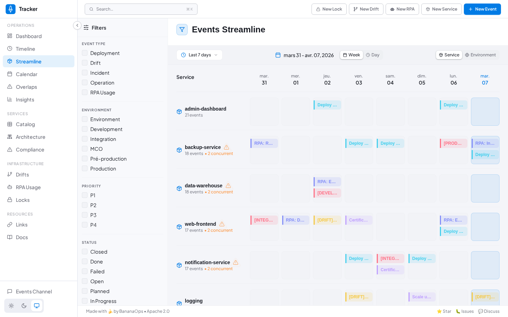

### Calendar

Monthly calendar view with per-day event details and overlap detection.

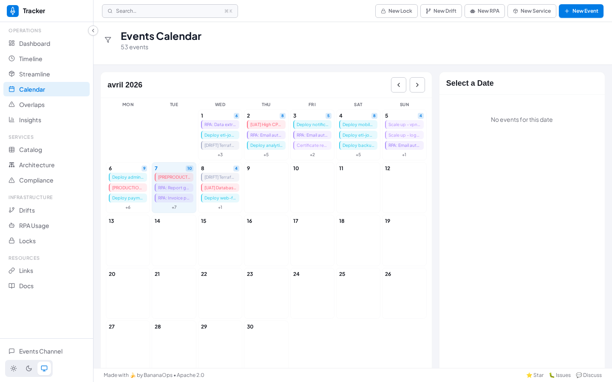

### Overlaps

Dedicated page for resolving scheduling conflicts with team contact information.

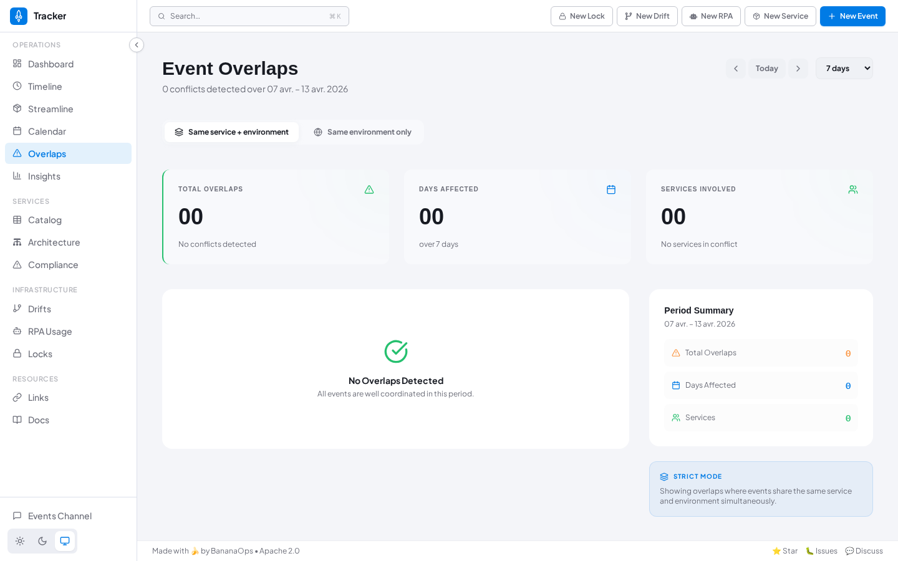

### Insights

Analytics over a configurable period — event distribution, top projects, and trends.

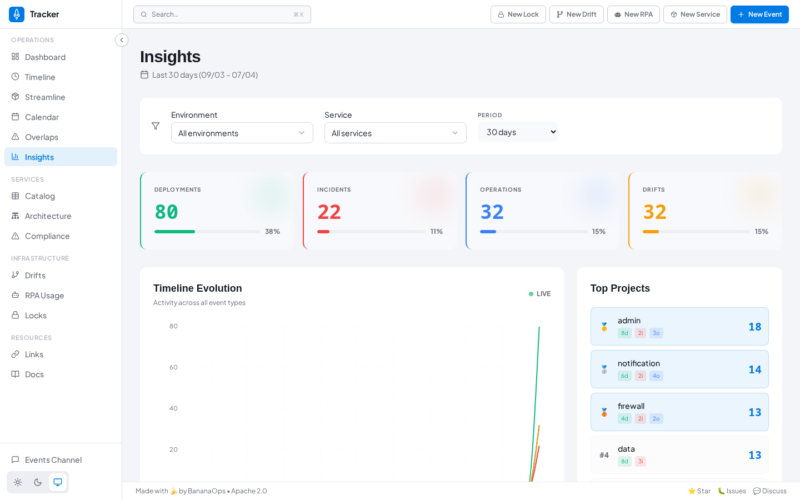

### Catalog

Inventory of all services, modules, libraries, and containers with version and owner tracking.

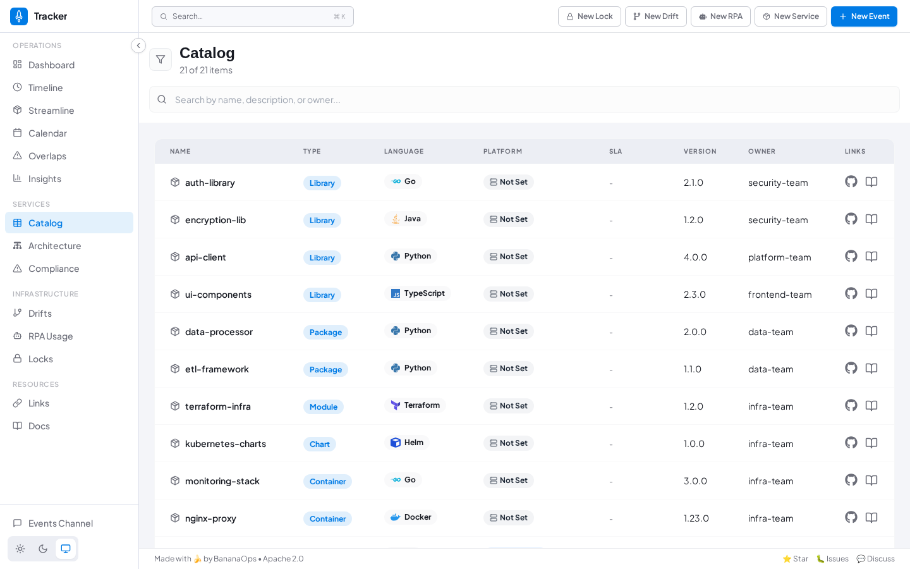

### Architecture

Interactive dependency graph of services registered in the catalog.

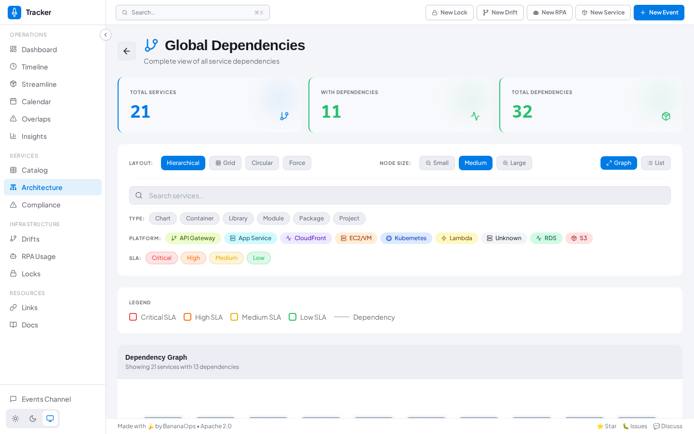

### Compliance

Version compliance tracking to identify projects using outdated deliverables.

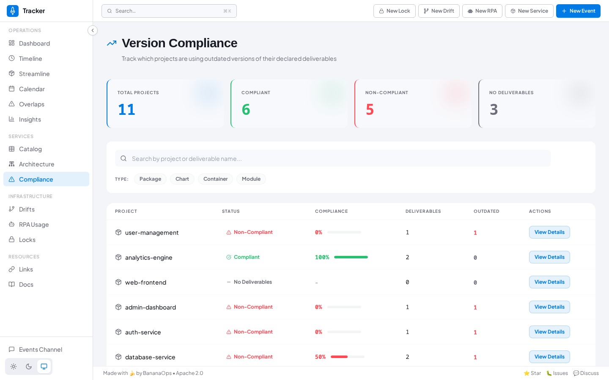

### Locks

View and manage deployment locks across all services and environments.

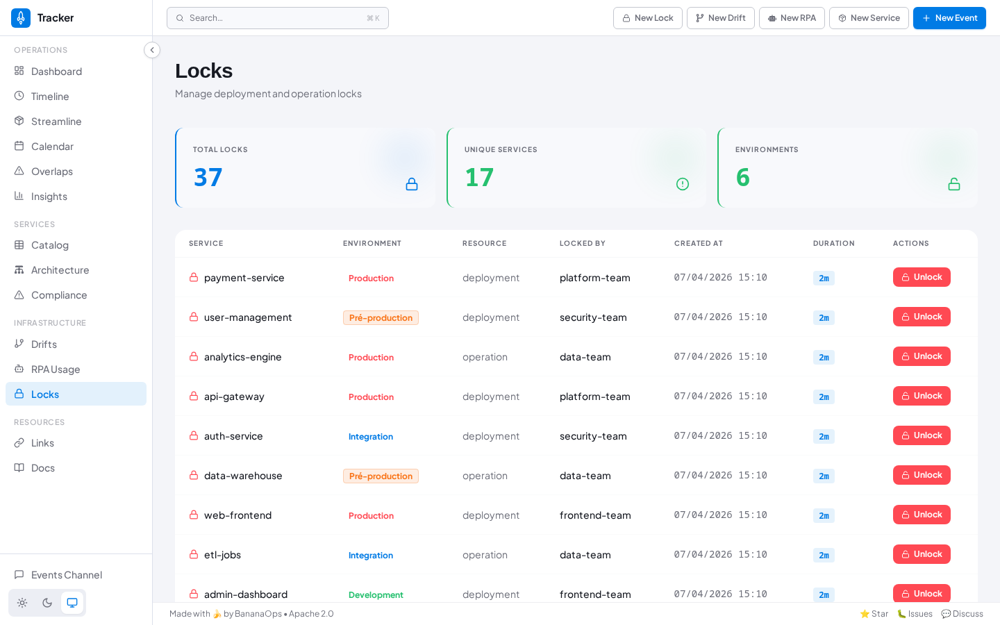

### Drifts

Track and manage configuration drifts with Jira integration.

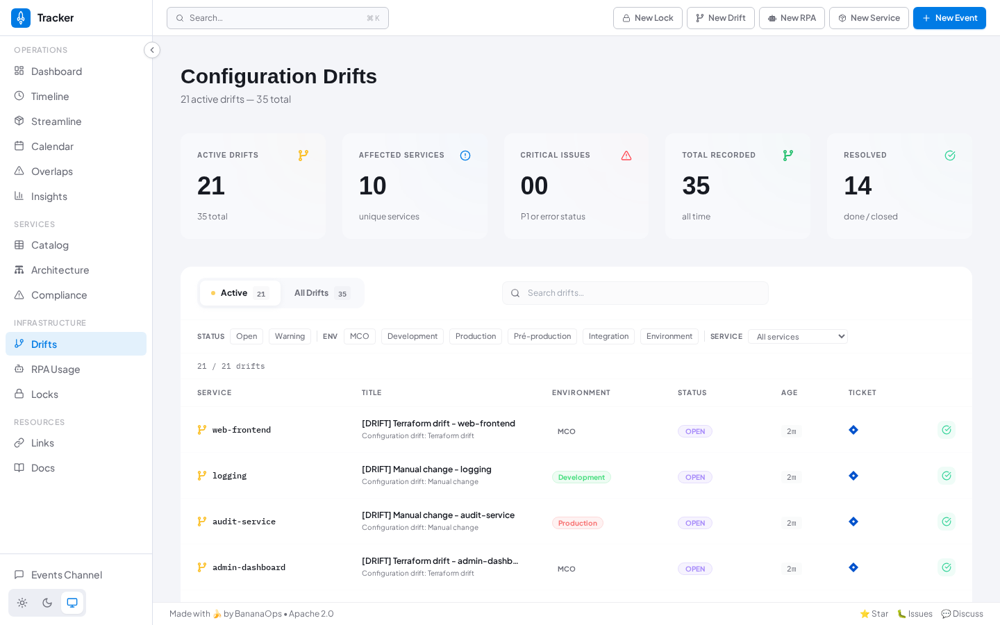

### RPA Usage

Monitor Robotic Process Automation executions.

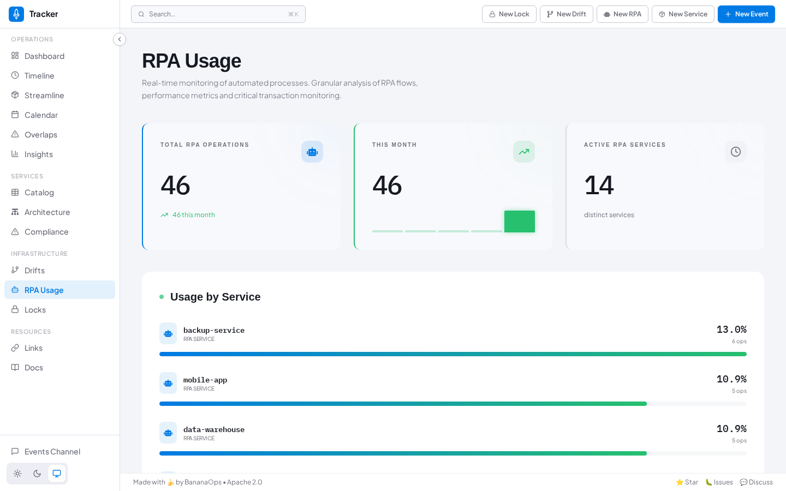

### Links

Quick access portal to all your tools and resources, synced from Homer.

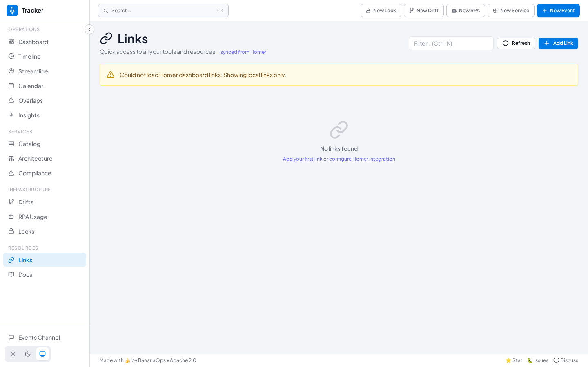

---

## ✨ Features

### 🎯 Event Management
- **Multiple Event Types**: Deployments, Operations, Drifts, Incidents, RPA Usage
- **Rich Metadata**: Priority, Status, Environment, Owner, Impact tracking
- **Linking**: Connect events to PRs, tickets, and related events
- **Search & Filter**: Powerful search across all event attributes
- **Timeline View**: Visualize events chronologically
- **Calendar View**: See events in a calendar format
- **Insights**: Analytics and trend visualization over configurable periods

### 📦 Service Catalog
- **Inventory Management**: Track modules, libraries, projects, containers
- **Version Tracking**: Monitor versions across your infrastructure
- **Multi-Language**: Support for Go, Java, Python, JavaScript, and more
- **Repository Links**: Direct links to GitHub/GitLab repositories
- **Architecture View**: Interactive service dependency graph
- **Compliance Tracking**: Identify projects with outdated deliverables

### 🔒 Distributed Locking
- **Exclusive Locks**: Prevent concurrent operations
- **Lock Ownership**: Track who owns which locks
- **Automatic Cleanup**: Locks expire automatically
- **Coordination**: Synchronize deployments and operations
- **Lock Management UI**: View and release locks directly from the interface

### 🎨 Modern UI
- **Collapsible Sidebar**: Clean navigation organized by domain
- **Dashboard**: Live activity stream with charts and statistics
- **Streamline**: Gantt chart with automatic overlap detection
- **Calendar**: Monthly calendar view of events
- **Dark / Light / System mode**: Three theme options
- **Responsive**: Works on desktop, tablet, and mobile
- **Global Search**: `Ctrl+K` instant search across all data
- **Quick Actions**: Header shortcuts to create events, locks, drifts, and more

### 🔌 API & Integration
- **gRPC API**: High-performance native API
- **REST API**: HTTP/JSON endpoints via grpc-gateway
- **Swagger UI**: Interactive API documentation
- **OpenAPI Spec**: Standard API specification
- **MCP Server**: Model Context Protocol for AI agents (Kiro, Claude, etc.)
- **Prometheus**: Built-in metrics endpoint
- **Homer Integration**: Sync links from your Homer dashboard

---

## 🚀 Quick Start

### Using Docker (Recommended)

```bash
# Build the image
docker build -t bananaops/tracker:latest .

# Run the container
docker run -d -p 27017:27017 --name tracker-mongo mongo:7
docker run -p 8080:8080 -p 8081:8081 -p 8765:8765 bananaops/tracker:latest
```

**Access the application:**
- 🌐 **Web UI**: http://localhost:8080
- 📚 **Swagger UI**: http://localhost:8080/docs
- 📊 **Metrics**: http://localhost:8081/metrics
- 🔌 **gRPC**: localhost:8765

### Using Docker Compose

```bash
# Start the application
docker-compose up -d

# View logs
docker-compose logs -f

# Stop the application
docker-compose down
```

### From Source

**Backend:**
```bash
# Clone the repository
git clone https://github.com/BananaOps/tracker.git
cd tracker

# Run the server
go run main.go serv
```

**Frontend:**
```bash
# Install dependencies
cd web
npm install

# Start development server
npm run dev
```

---

## 📖 Documentation

### Getting Started
- [🚀 Installation Guide](./docs/INSTALLATION.md) - Complete installation instructions
- [⚙️ Configuration Guide](./docs/CONFIGURATION.md) - Environment variables and settings
- [🔧 Development Guide](./docs/DEVELOPMENT.md) - Set up development environment

### User Guides
- [📖 User Guide](./docs/USER_GUIDE.md) - How to use Tracker
- [📊 Events Guide](./docs/EVENTS.md) - Working with events
- [📦 Catalog Guide](./docs/CATALOG.md) - Managing service catalog
- [🔒 Locks Guide](./docs/LOCKS.md) - Distributed locking

### API Documentation
- [🔌 API Specification](./docs/api-specification.md) - API reference
- [📚 Swagger UI](http://localhost:8080/docs) - Interactive API docs (when running)
- [🤖 MCP Server](./docs/MCP_SERVER.md) - Model Context Protocol server for AI agents

---

## 🏗️ Architecture

```
┌─────────────────────────────────────────────────────────────┐
│                        Web Browser                          │
│                    http://localhost:8080                    │
└────────────────────────┬────────────────────────────────────┘
                         │
         ┌───────────────┼───────────────┐
         │               │               │
    ┌────▼────┐    ┌────▼────┐    ┌────▼────┐
    │ React   │    │  REST   │    │ Swagger │
    │   UI    │    │   API   │    │   UI    │
    └─────────┘    └────┬────┘    └─────────┘
                        │
                ┌───────▼────────┐
                │  grpc-gateway  │
                │  (REST→gRPC)   │
                └───────┬────────┘
                        │
         ┌──────────────┼──────────────┐
         │              │              │
    ┌────▼────┐    ┌───▼────┐    ┌───▼────┐
    │ Event   │    │Catalog │    │  Lock  │
    │ Service │    │Service │    │Service │
    └────┬────┘    └───┬────┘    └───┬────┘
         │             │              │
         └─────────────┼──────────────┘
                       │
                ┌──────▼──────┐
                │   MongoDB   │
                │  / FeretDB  │
                └─────────────┘
```

---

## 🎯 Use Cases & Examples

### 1. Track Deployments

Create a deployment event via REST API:

```bash
curl -X POST http://localhost:8080/api/v1alpha1/event \
  -H "Content-Type: application/json" \
  -d '{
    "title": "Deploy service-api v2.1.0 to production",
    "attributes": {
      "message": "Deployed via GitHub Actions",
      "type": 1,
      "priority": 2,
      "service": "service-api",
      "status": 3,
      "environment": 7,
      "owner": "platform-team"
    },
    "links": {
      "pullRequestLink": "https://github.com/org/repo/pull/123",
      "ticket": "PROJ-456"
    }
  }'
```

**Response:**
```json
{
  "id": "507f1f77bcf86cd799439011",
  "title": "Deploy service-api v2.1.0 to production",
  "createdAt": "2024-01-15T10:30:00Z"
}
```

### 2. List Recent Events

```bash
# Get last 10 events
curl http://localhost:8080/api/v1alpha1/events?limit=10

# Filter by service
curl http://localhost:8080/api/v1alpha1/events?service=service-api

# Filter by environment
curl http://localhost:8080/api/v1alpha1/events?environment=7
```

### 3. Manage Service Catalog

Add a service to the catalog:

```bash
curl -X POST http://localhost:8080/api/v1alpha1/catalog \
  -H "Content-Type: application/json" \
  -d '{
    "name": "user-service",
    "type": 3,
    "language": 1,
    "version": "1.2.3",
    "repositoryUrl": "https://github.com/org/user-service",
    "description": "User management microservice"
  }'
```

### 4. Configuration Drift Detection

Track when infrastructure configuration deviates from expected state:

```bash
curl -X POST http://localhost:8080/api/v1alpha1/event \
  -H "Content-Type: application/json" \
  -d '{
    "title": "Terraform drift detected in production",
    "attributes": {
      "message": "Manual changes detected in AWS security group",
      "type": 3,
      "priority": 3,
      "service": "infrastructure",
      "environment": 7
    }
  }'
```

### 5. Distributed Locking

Acquire a lock before deployment:

```bash
# Acquire lock
curl -X POST http://localhost:8080/api/v1alpha1/lock \
  -H "Content-Type: application/json" \
  -d '{
    "name": "production-deployment",
    "owner": "ci-pipeline-123",
    "ttl": 3600
  }'

# Release lock
curl -X DELETE http://localhost:8080/api/v1alpha1/lock/production-deployment
```

### 6. RPA Usage Tracking

Monitor robotic process automation executions:

```bash
curl -X POST http://localhost:8080/api/v1alpha1/event \
  -H "Content-Type: application/json" \
  -d '{
    "title": "RPA: Invoice Processing Completed",
    "attributes": {
      "message": "Processed 150 invoices successfully",
      "type": 5,
      "priority": 1,
      "service": "invoice-automation",
      "status": 3
    }
  }'
```

### 7. Incident Tracking

```bash
curl -X POST http://localhost:8080/api/v1alpha1/event \
  -H "Content-Type: application/json" \
  -d '{
    "title": "Production API Outage",
    "attributes": {
      "message": "API returning 500 errors",
      "type": 4,
      "priority": 4,
      "service": "api-gateway",
      "status": 1,
      "environment": 7,
      "impact": 3
    },
    "links": {
      "ticket": "INC-789",
      "slackThread": "https://workspace.slack.com/archives/C123/p456"
    }
  }'
```

---

## 🛠️ Technology Stack

### Backend
- **Language**: Go 1.26.2+
- **API**: gRPC + REST (grpc-gateway)
- **Database**: MongoDB / FeretDB (with automatic index optimization)
- **Metrics**: Prometheus
- **Logging**: Structured JSON logs

### Frontend
- **Framework**: React 19
- **Language**: TypeScript 5
- **Build**: Vite
- **Styling**: Tailwind CSS
- **Icons**: Lucide React + Font Awesome
- **State**: React Query (TanStack Query)

### DevOps
- **Containerization**: Docker multi-stage builds
- **Orchestration**: Kubernetes + Helm
- **CI/CD**: Skaffold
- **Protocol**: Protocol Buffers (protobuf)

---

## 🤝 Contributing

We welcome contributions! Here's how you can help:

1. **🐛 Report Bugs**: [Open an issue](https://github.com/BananaOps/tracker/issues)
2. **💡 Suggest Features**: [Start a discussion](https://github.com/BananaOps/tracker/discussions)
3. **📝 Improve Docs**: Submit documentation improvements
4. **🔧 Submit PRs**: Fix bugs or add features

See [CONTRIBUTING.md](./CONTRIBUTING.md) for detailed guidelines.

### Good First Issues
Looking for a place to start? Check out issues labeled [`good first issue`](https://github.com/BananaOps/tracker/labels/good%20first%20issue) or [`help wanted`](https://github.com/BananaOps/tracker/labels/help%20wanted).

---

## 📊 Project Status

- ✅ **Core API**: Production ready
- ✅ **Web UI**: Production ready
- ✅ **Docker**: Production ready
- ✅ **Kubernetes**: Production ready
- ✅ **Slack App**: Production ready (project github tracker-slack)
- 🚧 **Github Action**: In development
- 🚧 **Webhooks**: Planned

---

## 📜 License

This project is licensed under the **Apache 2.0 License** - see the [LICENSE](LICENSE) file for details.

---

## 🌟 Star History

If you find Tracker useful, please consider giving it a star! ⭐

[](https://star-history.com/#BananaOps/tracker&Date)

---

<!-- CONTRIBUTORS_START -->
## 👥 Contributors

This project exists thanks to all the people who contribute. The contributors list is automatically updated.

Want to contribute? Check out our [Contributing Guide](./CONTRIBUTING.md)!
<!-- CONTRIBUTORS_END -->

---

## 💬 Community & Support

- **GitHub Issues**: [Report bugs or request features](https://github.com/BananaOps/tracker/issues)
- **GitHub Discussions**: [Ask questions and share ideas](https://github.com/BananaOps/tracker/discussions)
- **Documentation**: [Read the docs](./docs/)

---

<p align="center">
  Made with ❤️ by the <a href="https://github.com/BananaOps">BananaOps</a> community
</p>

<p align="center">
  <a href="https://github.com/BananaOps/tracker/stargazers">⭐ Star us on GitHub</a>
  •
  <a href="https://github.com/BananaOps/tracker/issues">🐛 Report a Bug</a>
  •
  <a href="https://github.com/BananaOps/tracker/discussions">💬 Join Discussion</a>
</p>
